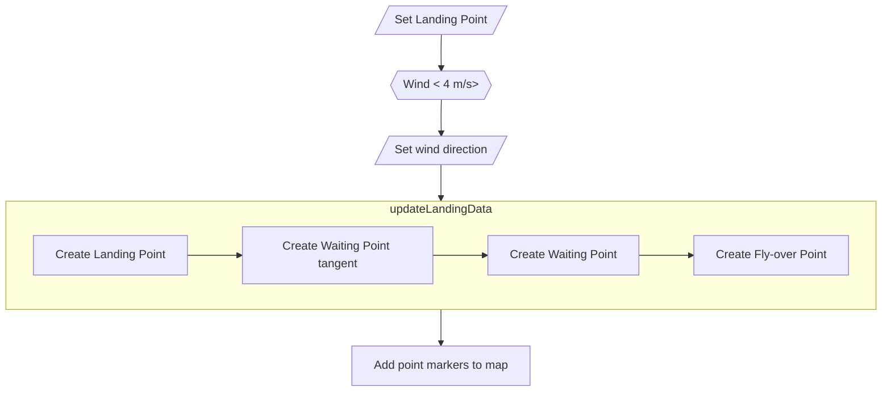
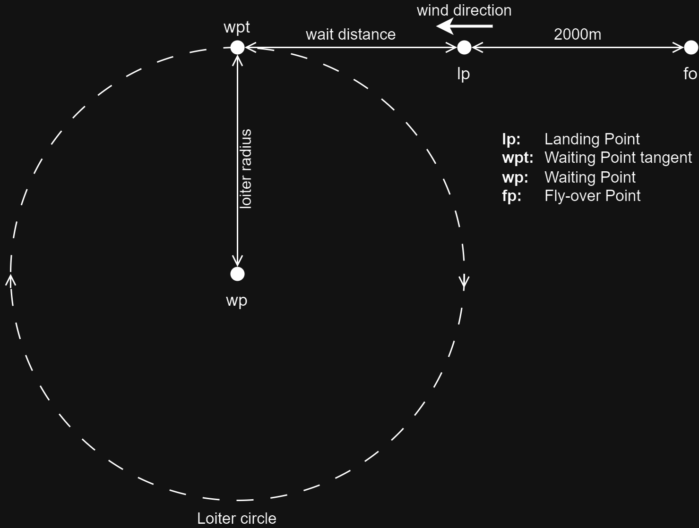
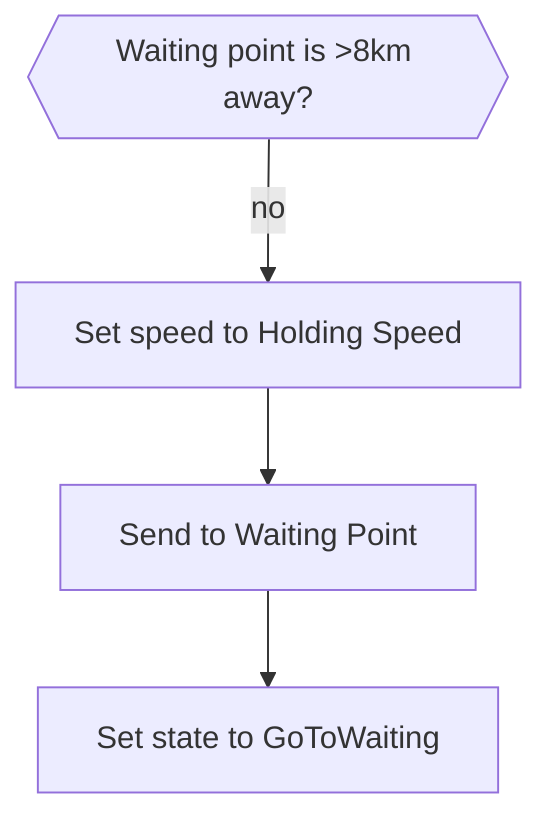
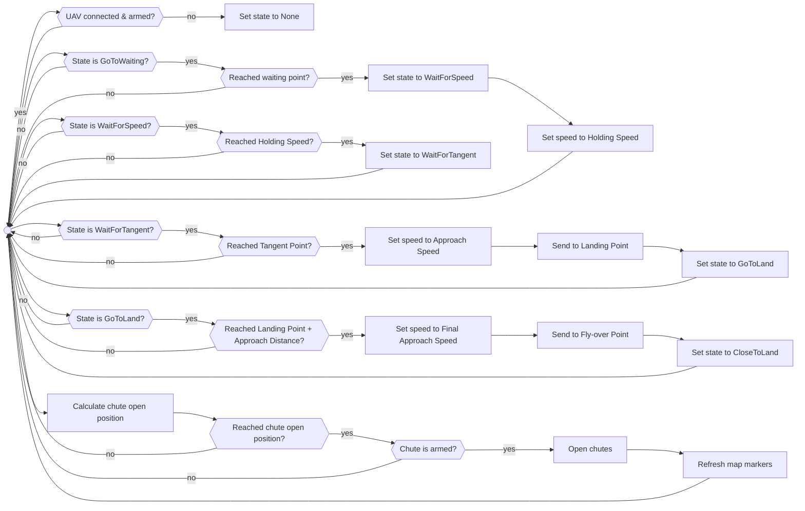

# Protar landing procedure<!-- omit from toc -->

1. [Landing point selection](#landing-point-selection)
2. [Landing points calculation](#landing-points-calculation)
3. [Landing procedure start](#landing-procedure-start)
4. [Landing procedure](#landing-procedure)
5. [Landing procedure state machine](#landing-procedure-state-machine)
6. [Landing settings window](#landing-settings-window)

## Landing point selection

## Landing points calculation

## Landing procedure start

## Landing procedure

The `doLanding` procedure is constantly running in a 5Hz loop.

## Landing procedure state machine

| Name | Meaning |
| --- | --- |
| None | No landing is requested |
| GoToWaiting | UAV is heading to the waiting loiter circle |
| WaitForSpeed | UAV is dropping it's speed to the desired value (Holding Speed) |
| WaitForTangent | UAV is heading to the tangent point on the waiting loiter circle |
| GoToLand | UAV is heading to the landing point |
| CloseToLand | UAV is on final approach to the landing point |
| Land | Not used |

## Landing settings window

